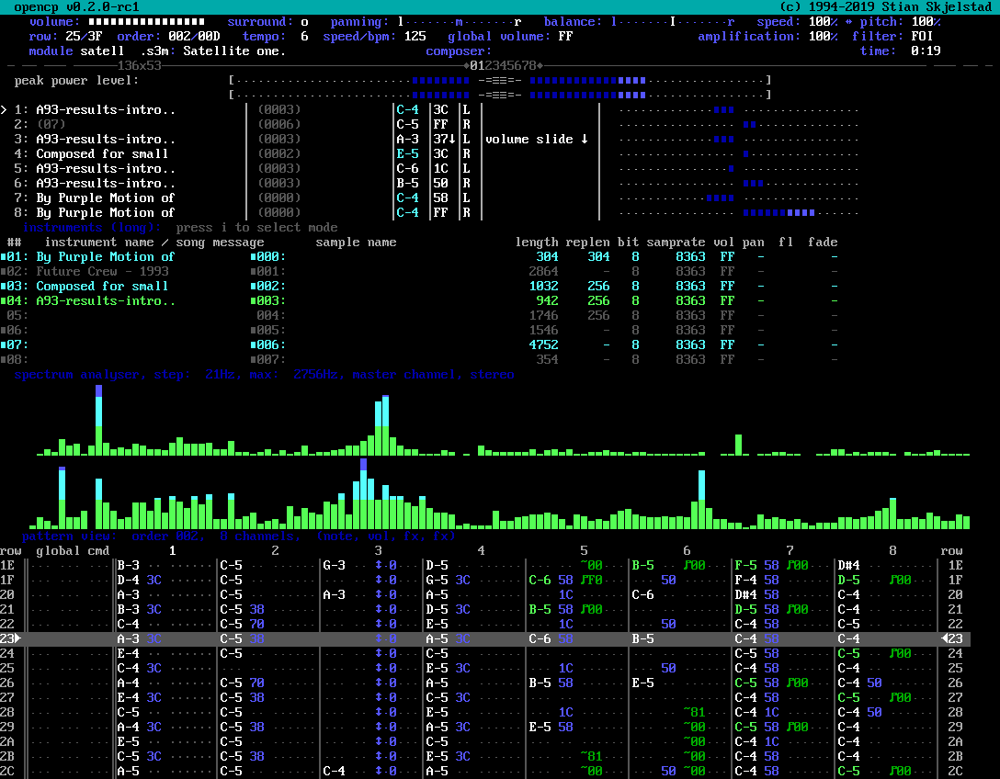

# What is it?

UNIX port of Open Cubic Player, which is a text-based player with some few graphical views. Visual output can be done through nCurses, Linux console (VCSA + FrameBuffer), X11 or SDL/SDL2. It can be compiled on various different unix based operating systems.

# What can it play?

Amiga style [modules](https://en.wikipedia.org/wiki/Module_file) files with more:
- \*.AMS
- \*.DMF
- \*.MXM
- \*.IT, http://schismtracker.org/
- \*.MOD, https://github.com/8bitbubsy/pt2-clone
- \*.MTM
- \*.OKT
- \*.STM
- \*.S3M
- \*.ULT
- \*.XM, https://github.com/8bitbubsy/ft2-clone
- \*.669

[Atari ST](https://en.wikipedia.org/wiki/Atari_ST#Technical_specifications) \([Yamaha YM2149](https://en.wikipedia.org/wiki/General_Instrument_AY-3-8910)\) style music using code from [STYMulator](http://atariarea.krap.pl/stymulator/):
- \*.YM

[C64](https://en.wikipedia.org/wiki/Commodore_64) \([SID 6581/8580](https://en.wikipedia.org/wiki/MOS_Technology_6581)\) style music:
- \*.SID

[ZX Spectrum](https://en.wikipedia.org/wiki/ZX_Spectrum)/[Amstrad CPC](https://en.wikipedia.org/wiki/Amstrad_CPC) \([Yamaha YM2149](https://en.wikipedia.org/wiki/General_Instrument_AY-3-8910)\) style music:
- \*.AY

Audio Files (both compressed and PCM styled):
- \*.WAV
- \*.OGG
- \*.FLAC
- \*.MP2
- \*.MP3

Audio CDs: Linux support only, using digital read out API
- \*.CDA

Fork of [TiMidity++](http://timidity.sourceforge.net/) is used to play [MIDI](https://en.wikipedia.org/wiki/MIDI#General_MIDI):
- \*.MID

[AdPlug](http://adplug.github.io/) can read a wide range of music formats designed for the [OPL2](https://en.wikipedia.org/wiki/Yamaha_YM3812)/[OPL3](https://en.wikipedia.org/wiki/Yamaha_YMF262) Adlib sound chip. Examples:
- \*.HSC
- \*.SNG
- \*.D00
- \*.ADL
- \*.VGM

[HivelyTracker](http://www.hivelytracker.co.uk/) tracked music, using code from the original tracker repository:
- \*.HVL
- \*.AHX

# Manual Page

https://manpages.debian.org/testing/opencubicplayer/ocp.1.en.html

# Usage

`double-esc`: exist the program

`ALT + K`: List the available keyshort-cuts in the current view

## While playing

`Enter`: next file from the playlist, if playlist is empty it opens the file-browser

`F`: File-browser

`A`: Text FFT analyzer, `shift-A`: toggle FFT analyzer, `tab`, toggle colors

`C`: Text Channel viewer

`T`: Text Track viewer

`G`: Lo-Res FFT analyzer + history
`Shift-G`: High-Res FFT analyzer + history

`B`: Phase viewer

`O`: Oscilloscope

`V`: Peak power level

`M`: Volume control

`X / ALT + X`: Extended mode / normal mode toggle

`Backspace`: Toggle filter

`F1`: Online Help

`F2`: Lower Volume

`F3`: Increase Volume

`F4`: Toggle Surround

`F5`: Panning left

`F6`: Panning right

`F7`: Balance left

`F8`: Balance right

`F9`: Decrease playback speed

`F10`: Increase playback speed

`\`: Toggle pitch/speed lock (if fileformat makes this possible)

`F11`: Decrease playback pitch

`F12`: Increase playback pitch

## File browser

`ALT + E`: Edit meta-information

`ALT + I`: Toggle file-list columns (long filename, title, etc.)

`ALT + C`: Opens a system options list

`Insert`: Add to playlist

`Delete`: Remove from playlist

`Tab`: Move cursor between filelist and playlist

# Original

https://www.cubic.org/player/

# Installing binaries on Linux

https://repology.org/project/ocp-open-cubic-player/versions

# Installing on macOS

`brew install ocp`

### more notes about Darwin

If you use liboss, you might need to edit `/opt/local/lib/pkgconfig/liboss.pc` and remove `-Wno-precomp` (liboss 0.0.1 is known to be broken and crashes, so I discourage the use of liboss)

To configure Darwin, my experience is that you need to run configure like this:

`PATH=$PATH:/opt/local/bin LDFLAGS=-L/opt/local/lib CFLAGS=-I/opt/local/include CXXFLAGS=-I/opt/local/include CPPFLAGS=-I/opt/local/include CPPCXXFLAGS=-I/opt/local/include ./configure`

and optionally add things like `--prefix` etc.

To get curses up and running with colors, you need to run ocp like this

`TERM=xterm-color ocp-curses`

# Sample sources of where to find music

https://modarchive.org/

http://www.chiptune.com/

http://www.keygenmusic.net/

https://ftp.hornet.org/pub/demos/music/contests/
